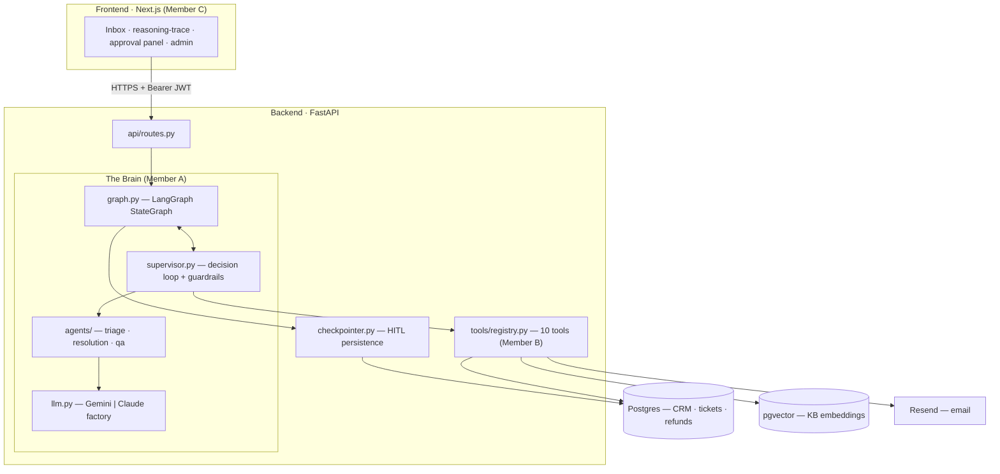
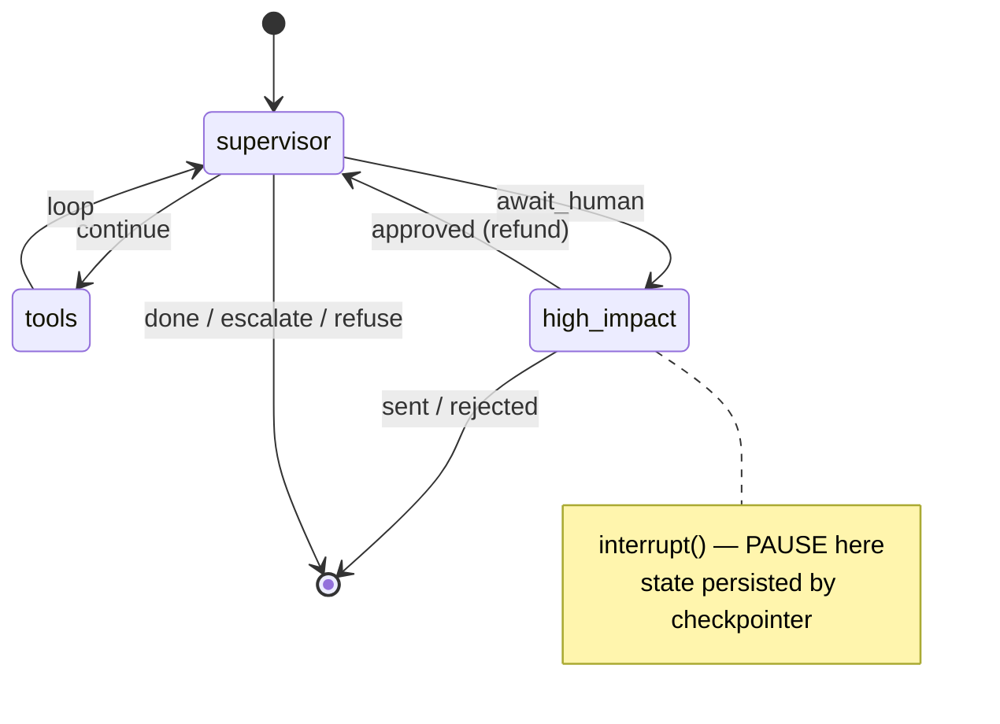
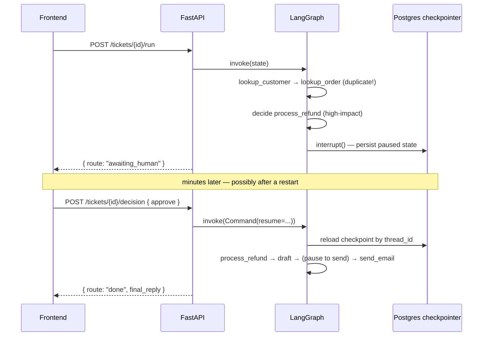
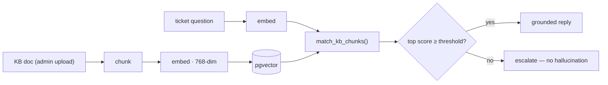
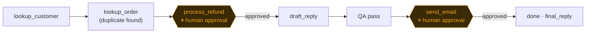

# TriageDesk — Architecture

> An AI support desk that resolves tickets in seconds, with **a human approving every action
> that touches money or the customer**. The design goal in one line: **speed *and* safety.**
>
> A *governed supervisor brain* picks tools at runtime (not a fixed flowchart), loops until the
> ticket is resolved, and **pauses for human approval** before any high-impact action. This doc
> explains how the pieces fit together. For the talk-track version, see the presentation deck in
> [`docs/presentation/`](presentation/).

---

## 1. System at a glance

Three slices, built against **frozen contracts** ([`contracts/`](../contracts/): Pydantic schemas,
`schema.sql`, `openapi.yaml`) so they could be developed in parallel.



| Slice | Where | Owner |
|---|---|---|
| **Brain + API** | `backend/{supervisor,graph,agents,api,auth,llm,prompts,observability}.py` | Member A |
| **Data + Tools + RAG** | `backend/{tools,rag,integrations,db}/` | Member B |
| **Frontend + Eval** | `frontend/`, `backend/tests/` | Member C |

---

## 2. The agents — four, with distinct jobs

Understanding a ticket, finding the answer, writing the reply, and checking it for safety are
*different skills with different failure modes*, so each is its own agent.

| Agent | File | Job | Structured output |
|---|---|---|---|
| **Triage** | [`agents/triage.py`](../backend/agents/triage.py) | classify the ticket | `Classification` |
| **Supervisor** | [`supervisor.py`](../backend/supervisor.py) | **the brain** — pick the next tool each step | `Decision` |
| **Resolution** | [`agents/resolution.py`](../backend/agents/resolution.py) | draft the customer reply | `DraftReply` |
| **QA** | [`agents/qa_review.py`](../backend/agents/qa_review.py) | check PII / policy / hallucination | `GuardrailResult` |

**Key point — the supervisor picks *tools*, not agents.** Triage runs once before the loop;
Resolution runs when the brain chooses the `draft_reply` tool; QA runs automatically right after
every draft. The LLM has freedom over *which tool*; Python controls *where the agents plug in*.

---

## 3. Shared state — `SupportState` + the scratchpad

One object flows through every step ([`contracts/schemas.py`](../contracts/schemas.py)). Its
**`scratchpad`** is the brain's working memory: the ordered list of `ToolResult`s it reads before
each decision — that's how it "remembers" the duplicate charge it just found.

```
SupportState
├─ ticket_id / subject / body / customer_id      ← input
├─ classification        (Classification)        ← triage output
├─ scratchpad: [ToolResult]   ◀── the brain's working memory
├─ decision              (Decision)              ← most recent tool choice
├─ draft / guardrail_result                      ← reply being built + QA verdict
├─ route                 (CONTINUE | AWAIT_HUMAN | DONE | ESCALATE | REFUSE)
├─ step_count / max_steps=8                       ← step-budget guardrail
├─ awaiting_action / human_decision               ← the HITL channel
└─ final_reply / escalated / audit_log            ← outcomes + trail
```

Every handoff between agents is a **Pydantic** model (`Decision`, `ToolResult`, `Classification`),
so the agents fit together by contract — and because `Decision.next_tool` is a `ToolName` **enum**,
an invalid tool name is rejected at parse time.

---

## 4. The LangGraph graph

The loop is a real `StateGraph` ([`graph.py`](../backend/graph.py)). Conditional edges branch on
`state.route` — that's the routing requirement.



- **supervisor** — runs the decision policy + guardrails, sets `route`.
- **tools** — runs one tool, appends a `ToolResult`, runs QA after a draft.
- **high_impact** — pauses for human approval via `interrupt()`, then executes or escalates.

The graph reuses the same decision and guardrail functions from `supervisor.py`, so there's a
single source of truth — the graph only adds structure + the real interrupt/resume mechanics.

---

## 5. Human-in-the-loop — how the pause survives two requests

High-impact tools (`process_refund`, `send_email`) **must** have human approval. The pause is a
true LangGraph `interrupt()`, persisted by a **Postgres checkpointer** keyed by
`thread_id = ticket_id` — so approval can arrive in a *separate* HTTP request, even after a restart.



The checkpointer is Postgres when `DATABASE_URL` is set (survives restarts; this is what creates the
`checkpoint_*` tables), otherwise an in-memory saver so the skeleton and tests still run HITL.

---

## 6. Tools, data, and RAG

The brain acts on **10 tools** ([`tools/registry.py`](../backend/tools/registry.py)), all sharing
one signature `fn(args, state) -> ToolResult` and dispatched through one function that catches
errors so a tool can never crash the brain. They're backed by **real Postgres**.

| Tool | What it does | Impact |
|---|---|---|
| `lookup_customer` · `lookup_order` · `check_subscription_status` | CRM reads; `lookup_order` **detects duplicate charges** | read |
| `search_past_tickets` | full-text search over resolved tickets | read |
| `retrieve_kb` | **RAG over pgvector** + grounding check | read |
| `request_more_info` · `create_bug_report` · `draft_reply` | ask / file / write reply | low |
| `process_refund` | **mock** refund (DB row + audit, no Stripe) | **HIGH → HITL** |
| `send_email` | **real** outbound email (Resend) | **HIGH → HITL** |

**RAG pipeline** ([`backend/rag/`](../backend/rag/)): help docs are chunked, embedded to **768-dim**
vectors, and searched by meaning.



Two things are mocked on purpose: inbound email (a "new ticket" form) and the refund. The approval
flow is identical either way.

---

## 7. Guardrails — the governance

Eight deterministic checks wrap the LLM ([`supervisor.py`](../backend/supervisor.py)):

| Guardrail | Effect |
|---|---|
| Out-of-scope | → refuse |
| Low confidence | → escalate |
| Critical severity | → escalate |
| Step budget = 8 | → escalate (no infinite loops) |
| Grounding floor (KB below threshold) | → escalate (no hallucination) |
| QA / PII pass on every draft | → redact if possible, else escalate |
| Allow-list (`ToolName` enum) | → only a valid tool name |
| **Human approval** | → before refund &amp; email |

---

## 8. Evaluation & observability

- **11 evaluation scenarios** ([`backend/tests/test_eval.py`](../backend/tests/test_eval.py)) — each
  asserts on the brain's **tool path** and **final outcome** for a ticket type. They're
  **deterministic** (the decider is injectable), so they test the loop, guardrails, and routing —
  not the LLM's random sampling — and run with no API key in under a second.
- **92 tests pass** overall across orchestration, tools, RAG, auth, and API.
- **LangSmith** traces every LLM call and graph step (no-op without a key) — how we caught issues
  like the brain looping or picking a wrong tool.

---

## 9. End to end — the duplicate-charge ticket



The brain discovered the refund **only after** the lookup (dynamic, not scripted) and **moved no
money without a human** — speed *and* safety, the whole thesis.

---

## Provider & infra notes

- **LLM is swappable** by one env var: `LLM_PROVIDER=gemini|anthropic` ([`llm.py`](../backend/llm.py)).
  Quota/outage degrades gracefully — the brain falls back to deterministic behavior instead of crashing.
- **Auth** ([`auth.py`](../backend/auth.py)): Supabase JWT (JWKS/ES256 or HS256), or open dev mode
  with no keys; role (`admin`/`agent`) gates the `/kb/*` routes.
- **Data model** ([`contracts/schema.sql`](../contracts/schema.sql)): customers, orders,
  subscriptions, tickets, messages, bug_reports, refunds, kb_documents, kb_chunks, audit_log, plus
  the `match_kb_chunks()` function and `vector` extension.
